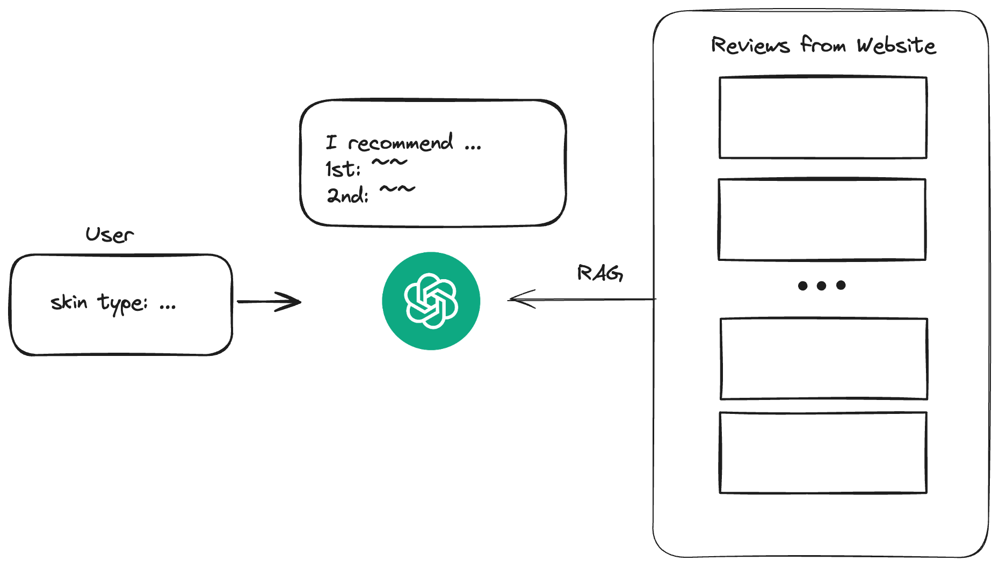

# 🧂 Whochoo (후추); 실사용 리뷰 기반 화장품 추천 챗봇 서비스

후추🧂의 공식 깃허브 레포입니다.
<!--   -->


## Overview
후추는 Langchain🦜, Streamlit, Huggingface🤗 등으로 구현된 RAG 추천 시스템입니다. 올리브영의 리뷰를 크롤링해 벡터DB를 생성하고, 유저의 질문과 가장 연관성 높은 리뷰들을 바탕으로 유저의 기호를 반영한 화장품을 추천해줍니다.

파일 및 디렉토리 목록
```
.
├── assets
├── chromedriver-win32
├── data
├── utils
├── README.md
├── crawling_one_json.py
├── main.py
├── rag.py
├── rag_local.py
├── requirements.txt
└── vectorstore.py
```
### Content
- [Set-up & Installation](#set-up--installation)
- [Run WhoChoo](#run-whochoo)
    - [Run WhoChoo with Streamlit!](#run-whochoo-with-streamlit)
    - [Test WhoChoo on Your Device!](#test-whochoo-on-your-device)
- [Team WhoChoo](#team-whochoo)

## Set-up & Installation
개발 환경
- Python 3.10.X
- Linux, NVIDIA A100 GPU x 2, cuDNN 11.8
Python venv 생성 후, `pip install -r requirements.txt`

## Run WhoChoo🧂
### Run WhoChoo with Streamlit!
0. [Huggingface](https://huggingface.co/) API Token 발급, 개인 메모, 로컬 기기 등에 저장
1. `utils/arguments.py` 내 `token`의 기본값 수정 
2. Streamlit으로 실행:
    ```
    streamlit main.py --server.port <port number>
    ```
3. 채팅창에 원하는 화장품 특징 입력

### Test WhoChoo on Your Device!
Streamlit 프레임워크 없이, python 실행 파일만으로 후추를 테스트하는 방법을 안내합니다.
1. Huggingface API 이용하여 테스트
    ```
    python rag.py \
        --token [API token] \ 
        --model_id [huggingface model repo] \ # optional
        --top_k 10 \ # optional, default 5
    ```
2. 로컬에서 모델을 다운로드 후 테스트 (GPU 사용 권장)
    ```
    python rag_local.py \
        --token [API token] \ 
        --model_id [huggingface model repo] \ # optional
        --top_k 10 \ # optional, default 5
    ```
## Team WhoChoo
- 김예은(팀장): 기획, 데이터 크롤링
- 김민서(기술총괄): RAG 구현
- 윤세림: UI/UX, 발표자료 
- 김연주: 기획(자료조사), 개발(프롬프트 엔지니어링), 발표자료
- 김도희: 개발 (프론트엔드)


